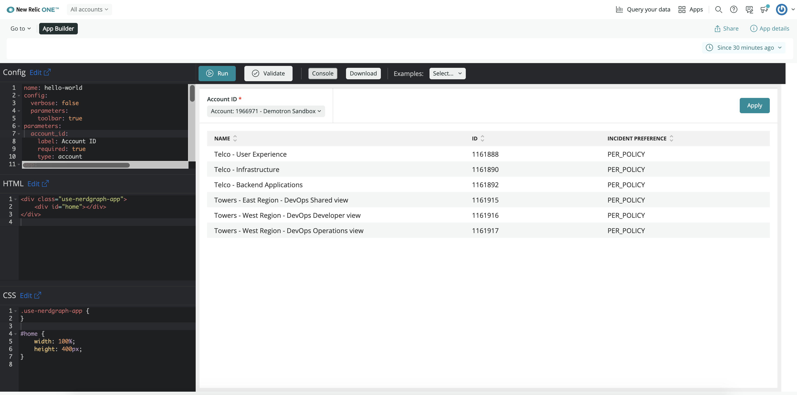

[](https://opensource.newrelic.com/oss-category/#new-relic-experimental)

# NR1 App Builder

The New Relic One App Builder is an application that allows you to build basic,
data-driven New Relic One applications using just YAML, HTML, and CSS.



## Getting Started

1. Ensure that you have [Git](https://git-scm.com/book/en/v2/Getting-Started-Installing-Git)
   and [NPM](https://www.npmjs.com/get-npm) installed. If you're unsure whether you
   have one or both of them installed, run the following command. (If you have
   them installed these commands will return a version number, if not, the
   commands won't be recognized.)

   ```bash
   git --version
   npm -v
   ```

2. Install the [New Relic One CLI](https://one.newrelic.com/launcher/developer-center.launcher)
   by going to [this link](https://one.newrelic.com/launcher/developer-center.launcher)
   and following the instructions (5 minutes or less) to install and set up your
   New Relic development environment.

3. Run the following command to clone this repository and run the code locally
   against your New Relic data:

   ```bash
   nr1 nerdpack:clone -r https://github.com/newrelic-experimental/nr1-app-builder.git
   cd nr1-app-builder
   nr1 nerdpack:serve
   ```

Visit [https://one.newrelic.com/?nerdpacks=local](https://one.newrelic.com/?nerdpacks=local),
navigate to the Nerdpack, and :sparkles:

## Usage

There are three parts to the New Relic One App Builder.

1. The App Builder "IDE" application
   The App Builder "IDE" is itself a New Relic One application that provides
   an ["JSFiddle"](https://jsfiddle.net/) type experience for building and
   testing New Relic One App Builder applications.
1. The App Builder runtime
   The App Builder runtime provides the logic behind the App Builder actions
   and the React components that are used to drive both the IDE and, more
   importantly, the applications produced by the IDE.
1. The App Builder loader
   The App Builder loader is the harness which bootstraps the runtime in an
   App Builder application.

Each application built with the New Relic One App Builder is composed of three
parts:

1. A YML configuration (inspired heavily by [Flex](https://github.com/newrelic/nri-flex))
1. One or more HTML templates built using [Handlebars](https://handlebarsjs.com/)
   (currently only one is supported)
1. A CSS stylesheet

### Config

The config is written in YML (or YAML, whichever you prefer).  It should look
real familiar to those who have used Flex.  It uses similar naming conventions
and concepts.  Here is [an example](./examples/use-nerdgraph/config.yml).

```yaml
name: use-nerdgraph
config:
  verbose: false
  parameters:
    toolbar: true
parameters:
  account_id:
    label: Account ID
    required: true
    type: account
app:
  home:
    actions:
    - action: run-gql
      query: >
        query($id: Int!) {
          actor {
            account(id: $id) {
              alerts {
                policiesSearch {
                  policies {
                    id
                    incidentPreference
                    name
                  }
                }
              }
            }
          }
        }
      variables:
        id: "${account_id}"
    - action: render-chart
      type: Table
      series:
        type: table
        values: "${results.actor.account.alerts.policiesSearch.policies}"
        columns:
        - name
        - id
        - incidentPreference
```

The configuration is made up of the following elements.

* The top level `name` is the name of the application. The `name` is required.
* The top level `config` section is used to specify various options. The
  `config` section is optional.
* The top level `variable_store` section is used to specify hard-coded variable
  values that can be used in the application.  The `variable_store` section is
  optional.
* The top level `parameters` section is a list of parameter definitions.  If
  specified, the application will render a left navigation or a toolbar where
  the user can enter values for each defined parameter.  The `parameters`
  section is optional.
* The top level `app` element is used to specify the logic of the application.

App Builder applications loosely follow an MVC (Model-View-Controller) pattern.
Each section of the `app` element can be thought of as a "Controller".  The name
of the controller (`home` in the above example) is a "Route".  When the route is
executed, the logic in the controller is run.  The HTML templates and
stylesheets are used to build the "Views" of the application.  Each controller
is associated with a single view.  The logic of the controller can produce one
or more UI components (charts, custom visualizations, etc).  Components are
mapped to elements in the HTML template and dynamically mounted into the DOM.  
The "Model" of the application is the data accessed in the logic of the
controller (via NRQL statements, GraphQL calls, or URLs).

**Note: Currently only a single view and controller are supported.**

The logic of a controller is specified with a set of actions.  Actions consist
of a type and a set of parameters and are run in order.  The current set of
actions consists of the following

* get-entities
* run-nrql
* run-gql
* get-url
* map
* join
* filter
* sort
* each
* render-chart
* render-component
* render-object

Some of the actions can also be used as transformations on other actions.
Transformations can be used to "transform" the results of other actions.  The
current set of actions that can be used as transformations consists of the
following.

* map
* join
* filter
* sort
* each

So how does this example application work?

The application has a single route/controller named "home".  The controller
logic consists of two actions: `run-gql` and `render-chart`.  When the
controller is executed, the `run-gql` action is run first.  This action makes a
GraphQL request against the [New Relic One Nerdgraph](https://docs.newrelic.com/docs/apis/nerdgraph/get-started/introduction-new-relic-nerdgraph)
using the GraphQL query in the `query` parameter.  The query contains a single
GraphQL variable called `id`.  The variables used in the query are specified
using the `variables` parameter.  The value of the `id` variable above is
specified using an expression.  In this case, the expression `${account_id}`.
Expressions are evaluated dynamically at runtime and are constructed using
[JSONPath](https://goessner.net/articles/JsonPath/).  More on that below.

After the `run-gql` action completes, the `render-chart` action is run.  The
`render-chart` method creates a new UI component made up of a
[New Relic One Chart component](https://developer.newrelic.com/components/charts).
The `type` parameter specifies that it is a [`Table`Chart](https://developer.newrelic.com/components/charts/table-chart/).
The `series` parameter specifies the data series for the chart.  It specifies
that the series type is `table`, the values are the result of the specified
JSONPath, and the columns to display are those listed.  Currently the `series`
element can be either an array or object and supports the `Unidimensional`,
`Two-dimensional`, and `Table` types as described
[here](https://developer.newrelic.com/components/charts).

#### JSONPath

New Relic One App Builder applications are primarily data driven.  The runtime
is designed to let you pull data from multiple sources, perform operations and
transformations on that data, and display the resulting data using New Relic One
charts and/or custom UI components.

In order to operate on the data retrieved from data sources, there must be some
way to specify the portions of the data on which to operate and display.  Since
much of today's data is represented in JSON format, a natural way to do so is
via [JSONPath](https://goessner.net/articles/JsonPath/).

JSONPath is a sort of but not really de facto spec for identifying parts of a
JSON object and is inspired by XPath.  Like writing XPaths, writing JSONPaths
can be a bit tricky but they are also super powerful and it beats writing
custom nerdlets every time you have a data processing use case.

As mentioned above, data on which an action should operate is specified via
"expressions".  Expressions are really JSONPaths that are written using either
the `${JSONPath}` syntax or the `$[JSONPath]` syntax.  The `${...}` and the
`$[...]` are not really part of JSONPath.  They are just used to identify that
the thing "inside" the `{}` or `[]` is a JSONPath.  For instance, in the example
above, there are two JSONPaths, one in each action.

In the `run-gql` action, there is an expression that specifies that value for
the `$id` variable used in the GraphQL query.

```yaml
      variables:
        id: "${account_id}"
```

In this case, `account_id` is actually a JSONPath.  Technically it is the
JSONPath `$.account_id`.  However, for convenience, you never have to specify
the leading `$.` when writing your JSONPaths.

In the `render-chart` action, the is an expression that specifies the data
for the data series displayed in the TableChart.

```yaml
      series:
        type: table
        values: "${results.actor.account.alerts.policiesSearch.policies}"
```

In this case, `results.actor.account.alerts.policiesSearch.policies` is the
JSONPath `$.results.actor.account.alerts.policiesSearch.policies` and it
selects all the policies returned by the GraphQL query in the `run-gql` action.

**PS: In an App Builder application, JSONPaths actually support
[JSONPath-plus](https://github.com/JSONPath-Plus/JSONPath) which has some useful
extensions to JSONPath.**

#### Context

JSONPaths are always evaluated against some context.  A context is just a JSON
object.  The context used in App Builder applications is an object that is
populated initially from all values within the `config` section of the config,
all values within the `variable_store` section of the config, and any default
values specified in the `parameters` section of the config.  The context lasts
for the lifetime of single execution of a controller.

Considering the `${account_id}` example, the initial context looks something
like the following.

```json
{
  "name": "use-nerdgraph",
  "verbose": false,
  "parameters": {
    "toolbar": true
  }
}
```

After a user selects an Account ID and clicks on "Apply" within the application,
but just before the `home` controller runs, the context looks like the
following (assuming the account id "1" was selected).

```json
{
  "name": "use-nerdgraph",
  "verbose": false,
  "parameters": {
    "toolbar": true
  },
  "account_id": 1
}
```

Therefore, the expression `${account_id}`, which is really the JSONPath
`$.account_id`, results in the value `1` when evaluated against the context.

Finally, the special value `_` always represents the result of the last action
unless you specified a variable name using the `store_variable` parameter
(which all actions support).

#### Actions

Actions consist of a type and a set of parameters.  At the moment, the 
parameters that an action accepts are only documented in the action files
themselves.  For example, here is the "documentation" for the `map` action
as specified in [the map.js file](./lib/actions/map.js).

```js
/*
 * action: map
 * to: string | object (child props)
 * from: jp | null (default: _)
 * store_variable: string | null (default: _)
 */
```

### HTML

The "View" parts of an App Builder application are specified as HTML
[Handlebars](https://handlebarsjs.com/) templates.  The
[evaluation context](https://handlebarsjs.com/guide/#evaluation-context) used
for the template evaluation is the final value of the context object after
running the last action in the controller.  The "template" can actually
be just plain HTML without using any of the template features.  Here is
[the HTML](./examples/use-nerdgraph/index.html) matching the example config
above.

```html
<div class="use-nerdgraph-app">
    <div id="home"></div>
</div>
```

This HTML is incredibly simple but there are two important things to note.

1. Components (charts or custom) can be mounted into the DOM fragment resulting
   from this HTML by specifying a `<div>` with an id attribute that matches the
   value of the `at` attribute specified on the `render-chart` or the
   `render-component` action.  If there is no `at` attribute specified on these
   tags, the component will be mounted on the element with the `id` value that
   matches the route name.  Therefore, when the HTML above is used with the
   example config above, the TableChart rendered using the `render-chart`
   component in the second (and final) action of the `home` controller will
   be mounted on the `<div id="home"></div>` element.
1. Even there are no [Handlebars expression](https://handlebarsjs.com/guide/#simple-expressions)
   used in the above example, the HTML is still a Handlebars template and is
   evaluated against the final context.

### CSS

The "View" parts of an App Builder application are styled using the a CSS
stylesheet.  Here is the CSS that matches (and completes) the example
application.

```css
.use-nerdgraph-app {
}

#home {
    width: 100%;
    height: 400px;
}
```

There is really not much special here.  It's plain old CSS.  However, there are
a few things to note.

1. It's best to nest everything under a top level class name so as not to clash
   with anything else on the page (including the actual New Relic One UI
   itself).
1. Always give your components (charts or custom) a `width` and `height`.  In
   particular, without a `height` attribute, most charts won't be displayed.

### The App Builder IDE

**TBD**

### Creating Your App

At some point (probably many points), you will want to actually build a real
New Relic One application instead of just running the application in the
App Builder IDE.  That is, after all, the end goal of building the app.

Before you can deploy a Nerdpack containing your application assets, you
actually need to create a Nerdpack.  This is, of course, a one time task.
After initial creation, you can just update the assets and redploy the
Nerdpack.  That said, creating the application containing your assets
is simple.  To do so, perform the following steps.

1. Use the `nr1` CLI to create a new nerdpack by using the command `nr1 create`
   and specifying a name for your new nerdpack.  Let's just say you name it
   `precious-hummingbird`.
1. Navigate into the root of the `nr1-app-builder` repository that you cloned
   in the [#getting-started] section (*NOT* the application directory you
   just created).
1. Run the command `./configure-app.sh /path/to/precious-hummingbird`.
1. In the App Builder IDE, click on the `Download` button.  Unzip the downloaded
   file and copy the contents to `/path/to/precious-hummingbird/app`.
1. Run npm start.
1. Enjoy your "no code" nerdlet.

### Updating Your Application Assets

After creating your application for the first time following the steps above,
you *can* continue to update the assets in the App Builder IDE and follow the 
"Download & Copy" procedure to overwrite the assets in your application.

However, it is much more convenient (and much more fun), to update the assets
directly in your application, while running the application locally.  Each
time you save the config, HTML, or CSS of your application, your browser will
refresh just like developing a "real" nerdlet!!


### Updating Your Application Runtime

Occassionally (or frequently), updates will be made to the App Builder runtime.
In this case, you will need to update your local `nr1-app-builder` repository
from [https://github.com/newrelic-experimental/nr1-app-builder](https://github.com/newrelic-experimental/nr1-app-builder)
and then update the copy of the App Builder runtime in your application.  Once
you have updated from the remote repository, updating your app is as simple as
re-running the `configure-app.sh` command.  That is,

1. Navigate into the root of the `nr1-app-builder` repository.
1. Run the command `./configure-app.sh /path/to/precious-hummingbird`.

## Examples

Several full examples (Config + HTML + CSS) can be found in
[the `examples` directory](./examples).

## Support

New Relic hosts and moderates an online forum where customers can interact with
New Relic employees as well as other customers to get help and share best
practices. Like all official New Relic open source projects, there's a related
Community topic in the New Relic Explorers Hub. You can find this project's
topic/threads here:

[https://discuss.newrelic.com/c/build-on-new-relic/nerdpacks](https://discuss.newrelic.com/c/build-on-new-relic/nerdpacks)

## Contributing

We encourage your contributions to improve [project name]! Keep in mind when you
submit your pull request, you'll need to sign the CLA via the click-through
using CLA-Assistant. You only have to sign the CLA one time per project.
If you have any questions, or to execute our corporate CLA, required if your
contribution is on behalf of a company,  please drop us an email at
opensource@newrelic.com.

## Security

As noted in our [security policy](../../security/policy), New Relic is committed
to the privacy and security of our customers and their data. We believe that
providing coordinated disclosure by security researchers and engaging with the
security community are important means to achieve our security goals.

If you believe you have found a security vulnerability in this project or any of
New Relic's products or websites, we welcome and greatly appreciate you
reporting it to New Relic through [HackerOne](https://hackerone.com/newrelic).

## License

The NR1 App Builder is licensed under the
[Apache 2.0](http://apache.org/licenses/LICENSE-2.0.txt) License.

The NR1 App Buildert also uses source code from third-party libraries. You can
find full details on which libraries are used and the terms under which they
are licensed in the third-party notices document.
